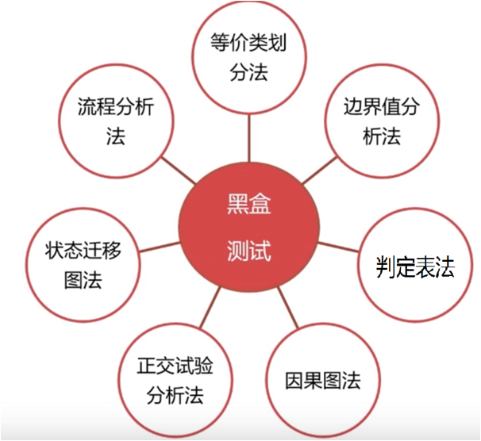
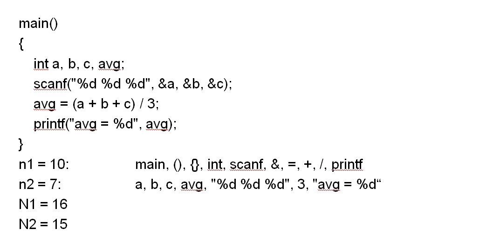

# 测试方法
- 白盒测试方法适合单元测试、集成测试，而不适合系统测试
## 黑盒测试及其方法
  - 黑盒法着眼于程序外部结构，不考虑内部逻辑结构；
  - 
    穷举输入/状态测试，测试情况有无穷多个；
  - 
    依据需求规范；
  - 
    检查程序实现的功能，是一种确认技术；
  - 
    也称为功能测试或数据驱动测试。

- 常用方法

### 等价类划分法：有效等价类AND无效等价类划分
  - 在输入条件规定了取值范围或值的个数的情况下,则可以确立一个有效等价类和两个无效等价类。如：输入值是学生成绩，范围是0～100；

  - 在输入条件规定了输入值的集合或者规定了"必须如何"的条件的情况下,可确立一个有效等价类和一个无效等价类；

  - 在输入条件是一个布尔量的情况下,可确定一个有效等价类和一个无效等价类。

  - 在规定了输入数据的一组值（假定n个）,并且程序要对每一个输入值分别处理的情况下,可确立n个有效等价类和一个无效等价类。

  - 在规定了输入数据必须遵守的规则的情况下,可确立一个有效等价类（符合规则）和若干个无效等价类（从不同角度违反规则）；

  - 在确知已划分的等价类中各元素在程序处理中的方式不同的情况下,则应再将该等价类进一步的划分为更小的等价类。

 ### 例题

 ### 边界值分析法
- 根据被测对象的输入（或输出）要求确定边界值
-  选取等于、刚刚大于、刚刚小于边界的值作为测试数据

### 判定表法

### 因果图法（一般是画完因果图后转化为判定表法

## 白盒测试及其方法
- 已知产品内部工作流程，通过测试来检测产品的内部动作是否按照详细设计规格说明的规定正常进行，而不管它的功能；
  
- 也称为结构测试或逻辑驱动测试；
  
- 目标是对所有逻辑路径进行测试，穷举路径；
  
- 依据详细设计规范；
  
- 一种验证技术

### 基于控制流的测试

- 语句覆盖

- 分支覆盖

- 条件覆盖

- 条件组合覆盖

- 基本路径覆盖

- 循环覆盖
### 数据流覆盖

## 静态测试，动态测试的概念
- 静态测试
  - 静态测试是不动态执行程序代码而寻找程序代码中可能存在的缺陷或评估程序代码的过程。

- 动态测试
  - 动态测试是通过观察代码运行时的动作，来提供执行跟踪、时间分析，以及测试覆盖度方面的信息。动态测试通过真正运行程序发现错误。通过有效的测试用例，对应的输入输出关系来分析被测程序的运行情况。

### 所以判断一个测试属于动态测试还是静态的，唯一的标准就是看是否运行程序。

## 软件测试的级别

## 单元测试

## 测试类型

## 性能测试相关概念
- 配置测试
  
- 兼容性测试
 
- 外国语言测试
  
- 易用性测试
 
- 软件安全性测试
  
- 网站测试
  
- 性能测试
- 性能测试定义：
  - 检测系统的性能表现，包括特定情况下，系统的响应能力和稳定性

- 性能测试的目的：
   - 性能测试主要评价系统或组件的性能是否和具体的性能需求一致。例如：对访问速度的性能需求或对内存使用情况的需求。
    
   - 特定性能测试的关注点在于组件或系统在规定的时间内和特定的条件下响应用户或系统输入的能力。

- 性能度量方法
  - 系统资源开销：CPU，内存等
    
  - 稳定性：是否容易宕机
    
  - 执行速度：常用响应时间、吞吐量、吞吐率来表示

- 不同的性能的度量方法取决于不同的被测对象
    - 对于单独软件组件，其性能可根据CPU主频来判定
  
    - 对于带客户端的系统，其性能则要根据系统处理特定用户请求的响应时间来判定
 
    - 对于由多种组件（如客户端、服务器、数据库）构成的系统，则要进行各组件之间的性能测试

- 负载测试
  - 负载测试是一种通过增加负载来评估组件或系统的性能的测试方法。
    
  - 例如：通过增加并发用户数和（或）事务数量来测量组件或系统能够承受的负载。

- 压力测试
  - 压力测试和负载测试的区别在于是否超出了系统的预期负载

### 其他重要概念

- 响应时间
  - 服务器收到请求的时刻开始计时，到服务器完成请求执行的这一段时间的间隔。

- 并发量
  - 并发请求发出的间隔时间非常的短，可以在“毫秒”级别内。

  - 并发请求会对系统的处理造成一定的混乱。

- 吞吐量
  - 是单位时间内完成工作量的量度。
    
  - 描述系统能够处理交易的能力。
    
  - 衡量一个系统是否可用的最直接的指标。
    
  - 期望值
    
  - 越大越好，但不知道具体的数值。

## 网络安全性测试

### 常见的网络攻击方法

- Google hack
  
- 网页爬行
  
- 暴力猜解
 
- Web漏洞扫描
  
- 错误信息利用
 
- 根据服务器版本寻找现有的攻击代码
  
- 利用服务器配置漏洞
 
- 文件上传下载
  
- 构造恶意输入（SQL注入攻击、命令注入攻击、跨站脚本攻击）
  
- HTTP协议攻击
 
- 拒绝服务攻击
  
- 其他攻击点利用（Web Services, Flash, Ajax, ActiveX, JavaApplet）
  
- 业务逻辑测试

### 网络攻击防范措施

### 网络安全性测试

## 质量保证
### 质量和度量的区别和联系

- 软件质量的含义
  - 需求是度量软件质量的基础
   
  - 遵守标准中规定的开发准则
   
  - 满足明确定义需求，还要满足隐含的需求
    
  - 软件质量是各种特性的复杂组合

- 软件质量模型
  - 软件质量由软件质量特性反映
    
  - 软件质量的特性需要用软件质量模型来描述
    
  - 软件质量模型为分层模型
   
  - 基质量特性由一些子质量特性和度量构成

- 软件度量
  - 定义： 是对软件开发项目、过程及其产品进行数据定义、收集以及分析的持续性定量化过程
    
  - 目的：理解、预测、评估、控制和改善
    
  - 方法：测试、审核、调查
    
  - 工具：统计、图表、数字、模型
   
  - 最终：量化的指标

### 软件质量模型
- McCall质量模型是基于11个特性的，分别面向软件产品的运行、修订、变迁。

- Boehm质量模型兼顾不同类型的用户
    - 最终顾客：系统做了顾客所期望的事，顾客对系统非常满意
 
    - 要将软件移植到其他软硬件系统下使用的客户
  
    - 维护系统的程序员

- ISO 9126 
  - 出发点在于使软件最大限度的满足用户明确的和潜在的需求。
   
  - 六个质量特性最大可能的涵盖了质量模型中所有的因素，而且彼此的交叉性最小。
   
  - 软件质量特性与子特性的定义考虑了
    
  - 用户的角度
   
  - 开发者的角度
   
  - 管理者的角度

### 软件度量方法

- 计算圈复杂度
